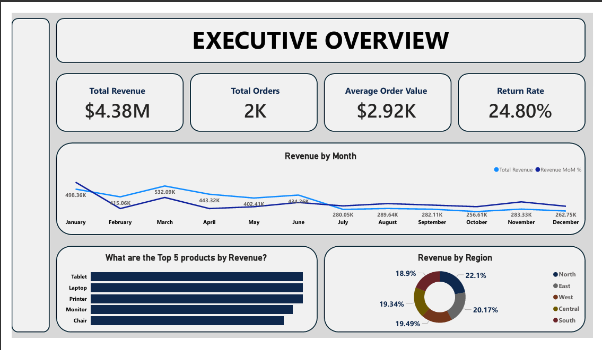
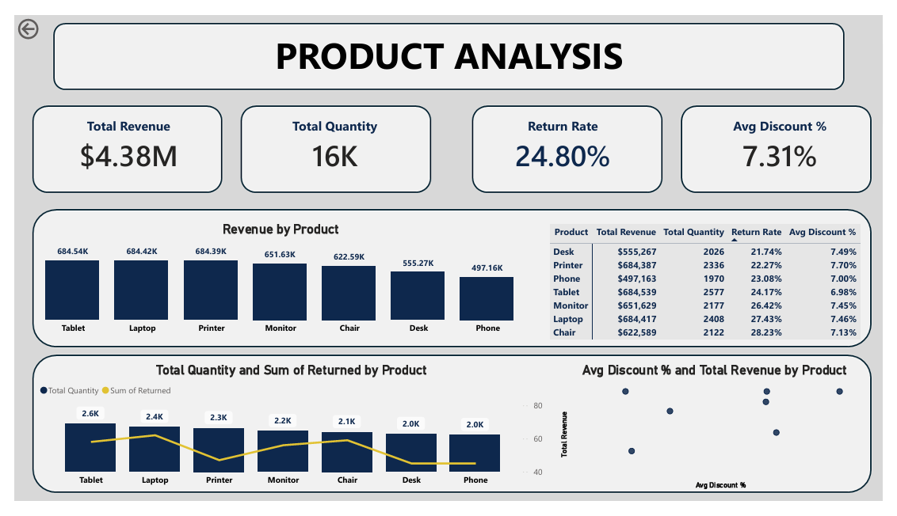
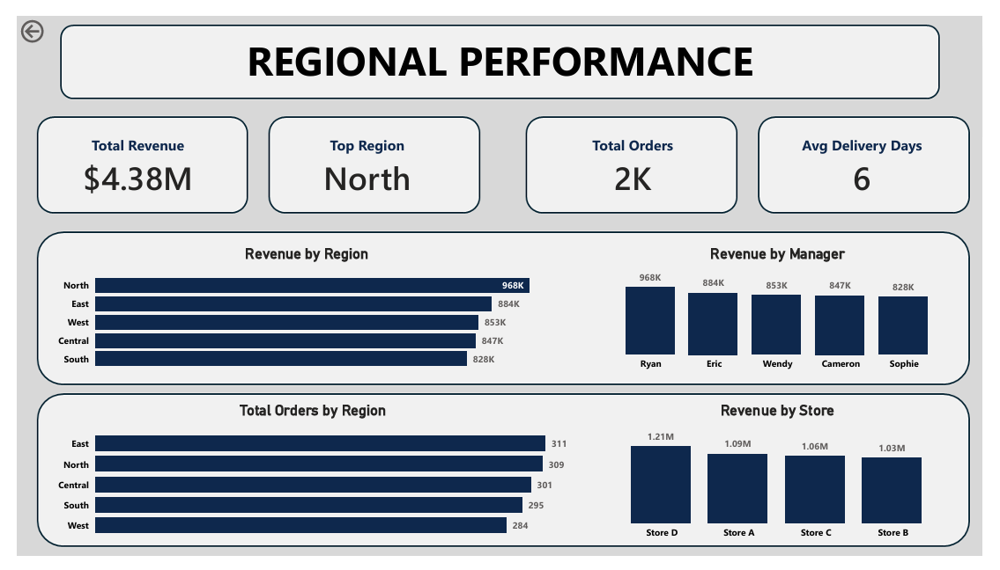
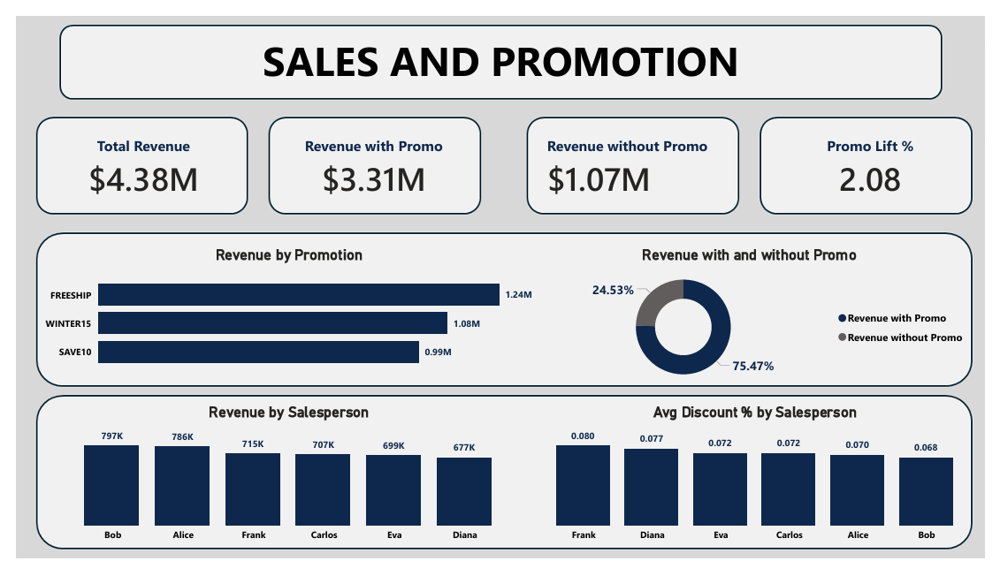

# 📊 Retail Sales Power BI Dashboard

## Project Overview
An interactive 5-page sales analytics dashboard built in Power BI
analyzing 2,000 retail orders totaling $4.38M in revenue across
multiple regions, products, salespersons and promotions.

---

## Dataset Overview
| Field | Details |
|---|---|
| Total Revenue | $4.38M |
| Total Orders | 2,000 |
| Total Quantity | 16,000 units |
| Avg Order Value | $2.92K |
| Return Rate | 24.80% |
| Avg Delivery Days | 6 days |
| Avg Discount % | 7.31% |

---

## Dashboard Pages

### Page 1 — Executive Overview

- KPI Cards: Total Revenue, Total Orders, Average Order Value, Return Rate
- Revenue trend line chart by month
- Top 5 products by revenue (bar chart)
- Revenue by region (donut chart)

---

### Page 2 — Product Analysis

- KPI Cards: Total Revenue, Total Quantity, Return Rate, Avg Discount %
- Revenue by product (bar chart)
- Total quantity vs returns by product (clustered bar)
- Avg discount % vs revenue by product (scatter plot)

---

### Page 3 — Regional Performance

- KPI Cards: Total Revenue, Top Region, Total Orders, Avg Delivery Days
- Revenue by region (bar chart)
- Revenue by manager (bar chart)
- Total orders by region (bar chart)
- Revenue by store location (bar chart)

---

### Page 4 — Sales & Promotions

- KPI Cards: Total Revenue, Revenue with Promo, Revenue without Promo,
  Promo Lift %
- Revenue by promotion name (bar chart)
- Revenue with and without promo (donut chart)
- Revenue by salesperson (bar chart)
- Avg discount % by salesperson (bar chart)

---

## DAX Measures Built
- Total Revenue = SUM('Table1'[total price])
- Total Orders = DISTINCTCOUNT('Table1'[orderID])
- Total Quantity = SUM('Table1'[quantity])
- Average Order Value = DIVIDE([Total Revenue], [Total Orders])
- Return Rate = DIVIDE(COUNTROWS(FILTER(...)), [Total Orders])
- Avg Discount % = DIVIDE(SUM([discount]), SUMX(...))
- Avg Delivery Days = AVERAGEX('Table1', DATEDIFF(...))
- Revenue with Promo = CALCULATE([Total Revenue], promotion <> "")
- Revenue without Promo = CALCULATE([Total Revenue], promotion = "")
- Promo Lift % = DIVIDE([Revenue with Promo] - [Revenue without Promo],
[Revenue without Promo])
- Revenue MoM % = VAR CurrentMonth... RETURN DIVIDE(...)
- Revenue YoY % = DIVIDE([Total Revenue] - CALCULATE(...), CALCULATE(...))

  ---

## Key Findings
- Tablet led revenue at $684.54K, closely followed by Laptop and Printer
- North region generated highest revenue at $968K out of $4.38M
- Store D was top performing location at $1.21M
- Promotions drove 75.47% of total revenue — business is heavily 
  promotion-dependent
- FreeShip was the best performing campaign at $1.24M
- Bob led salesperson revenue at $797K
- Return rate of 24.80% is critically high — 1 in 4 orders returned
- Revenue declined 51.9% from March to October

---

## Tools Used
- Microsoft Power BI Desktop
- DAX (Data Analysis Expressions)
- Power Query

---

## Files
- `dashboard.pdf` — Full 5-page dashboard export
- `README.md` — Project documentation

---

## Author
**Onifade Oluwagbemiga**
Data Analytics Intern — DecodeLabs
